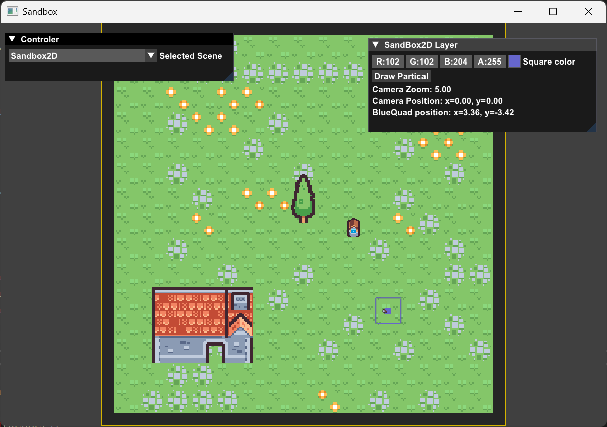
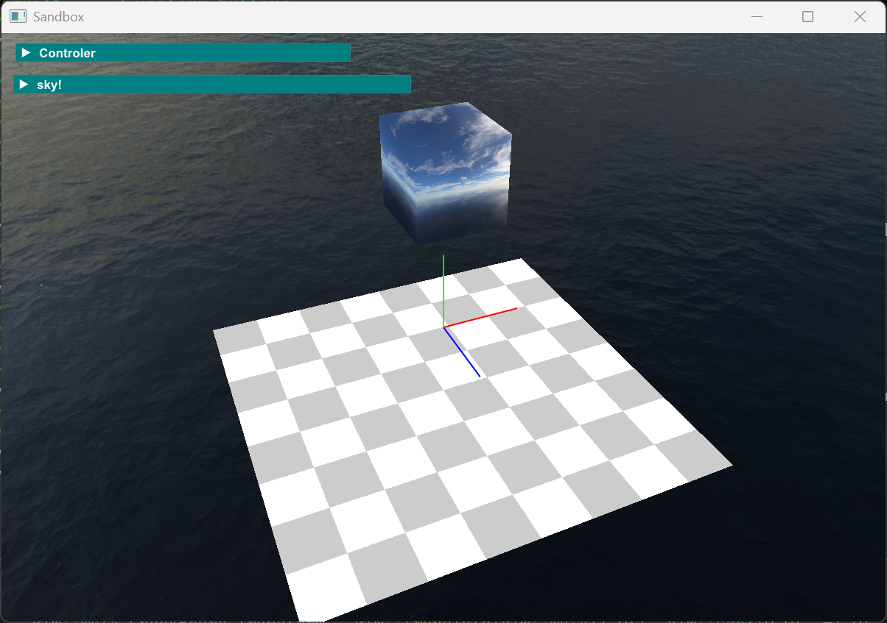
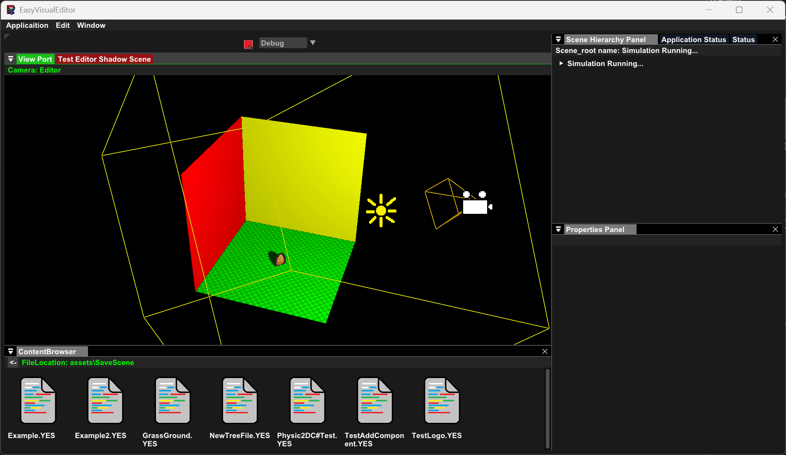

# 欢迎使用EasyVisualEngine
## 简单介绍
1. EasyVisual是一个快速构建图形场景应用的引擎
2. EasyVisual目前只支持Windows平台，但支持拓展到其他平台
3. BuildProjects-Win64-VS2022.bat只生成VS2022的工程，如果你的版本太低请自行修改bat文件！

## 展示

## 引擎特色
1. 目前使用***OpenGL4.6***作为图形库，并且已经把一些比较常见渲染概念抽象完成，无需自己重新手搓轮子(除非你很闲，像我一样，过程比较的繁琐和坐牢)。程序在大多数的显卡上都能运行(也许吧，我没有那么多的显卡做测试，但是N卡完美运行)，内置专用的2D渲染系统，开箱即用
2. ECS部分使用的是***ENTT***库，性能完美，开箱即用，而且也已经抽象和封装完成(按照我个人想法)你觉得不会用?我已经在头文件里面写了很多注释，告诉你何时调用，调用后会发生什么奇迹等等，如有需求我会再写一个wiki教程和示范(大概等到那天我又很闲吧)
3. 内置C#脚本系统，使用的是mono框架，需要搭配EasyVisualEditor应用，与ECS引擎高度耦合，能够让你写几行C#代码完成一个对实体的操作，但是这个你可能用不上，这是为编辑器应用而准备的
4. 内置***ImGui***以及它的拓展的UI库，方便你即时调试你的渲染图形，当然这个库也被作为编辑器界面主要的UI库
5. 内置优秀的日志系统，使用的是***spdlog***库，方便你输出格式化好的信息，而且还支持断言并输出信息
6. 内置***Yaml***文本序列化库，可直接调用，用于给你自定义序列化文本

## EasyVisual工程初始化步骤：
1. 请先运行VulkanSDK安装程序(需要自己上网下载安装包)完成安装！记得在安装时勾选拓展工具！以防缺库(提示：SDL2也不需要因为我们使用GLFW生成窗口，ARM64的那个可以不用因为用不上，glm也可以不用，因为我们的引擎里已经提供，Volk也不需要因为用不上)
2. 接着运行BuildProjects-Win64-VS2022.bat开始配置工程文件，全程自动等待终端提示结束即可。

## 提示
### 项目自定义：
1. 本工程文件使用premake5配置，详细的配置在每个项目的premake5.lua文件里，如有需求可以根据实际情况进行修改。修改后不确保稳定性
2. 如果你的VulkanSDK作出修改(比如**更新版本**或者**更改路径**等)，请完成后重新再运行一次BuildProjects-Win64-VS2022.bat更新工程配置，以防出问题
3. 如果你想要基于该引擎构建一个自定义的程序，可以参考SandBox文件中的premake5.lua文件，作出适当的调整，最后在工程主目录下的premake5.lua中导入它！然后再重新运行BuildProjects-Win64-VS2022.bat就会自动帮你生成工程文件!!!

### 工程文件说明：
1. EasyVisualEngine是引擎，是构建应用程序的核心。属于静态库
2. EasyVisualScriptCore是引擎的嵌入式程序的核心，使用C#语言进行快速编程，是编辑器构建应用程序的核心之一，注意使用的是mono框架，该核心库在vendor/mono中，**无需额外安装本地核心库**。属于动态链接库
3. SandBox是沙盒程序，用于测试引擎，也是一个使用引擎的一个最基本的示例。属于exe启动项目(当然你也可以直接在这个项目里添加文件直接开始你的作品)
4. EasyVisualEditor是编辑器，用于快速构建加载2D场景，通过写C#脚本对实体的Component作出控制

## 改进
1. 未来将可能添加3D模型加载器以及专用的3D渲染器。
2. 添加Vulkan作为第二个图形API。
3. 添加音频系统。可能使用OpenAL库，但是还没找到合适的工具加载常见的音乐格式文件,比如**mp3**文件。因为OpenAL好像只兼容.wav音频文件?
